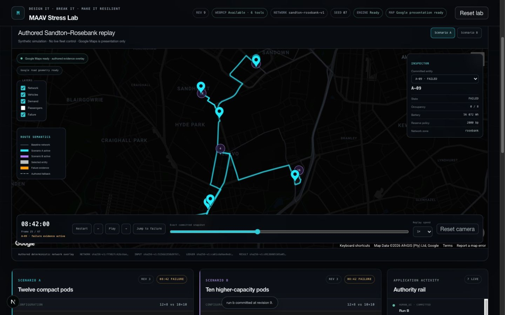
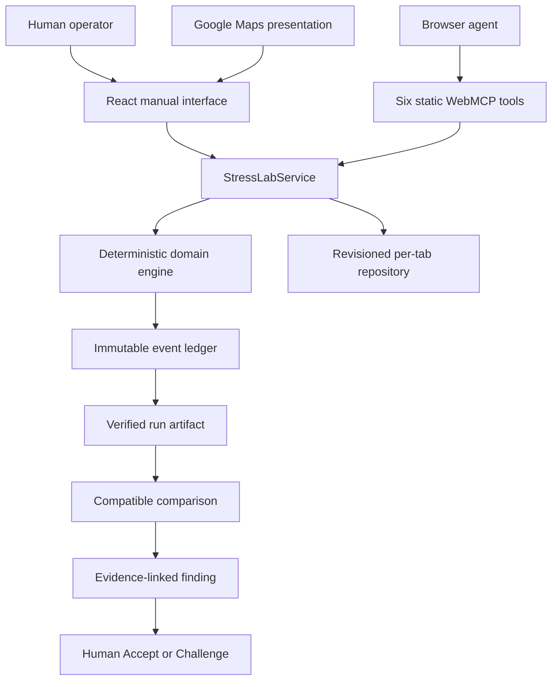
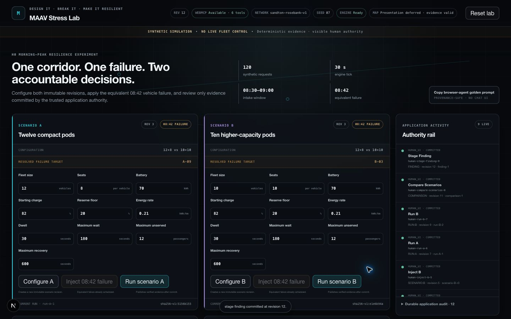
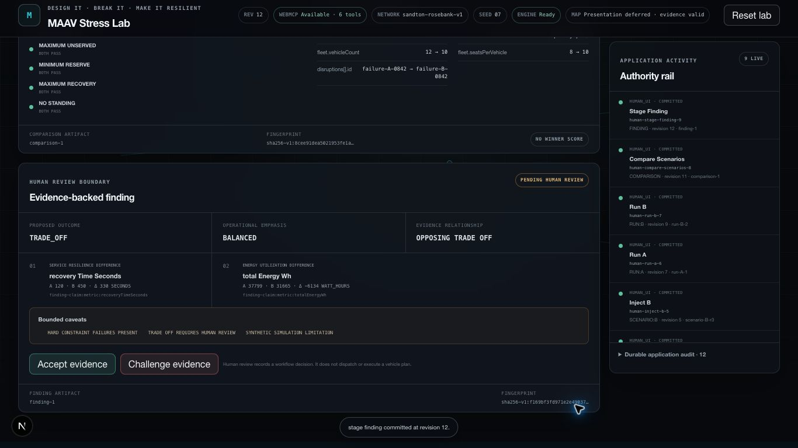

<div align="center">


# MAAV NeoLab · v0.5

### Design it. Break it. Make it resilient.

**An AI-native proving ground for early mobility ideas.**<br />
Describe the experiment. Stress the alternatives. Decide from reproducible evidence.

[](docs/WEBMCP_TOOLS.md)
[](#verification)
[](https://nextjs.org/)
[](https://www.typescriptlang.org/)
[](LICENSE)

[**Launch NeoLab**](https://maav-mobility-webmcp.vercel.app/lab) · [Architecture](docs/ARCHITECTURE.md) · [Six WebMCP tools](docs/WEBMCP_TOOLS.md)

**MAAV Stress Lab · Synthetic simulation · No live fleet control · Human-reviewed findings**

</div>



## From imagination to evidence

Mobility planners, researchers, and R&D teams ask ambitious questions early:

- What if a city used smaller autonomous pods instead of fewer high-capacity vehicles?
- What happens when the busiest vehicle fails during the morning peak?
- Which design protects service quality, energy use, and recovery—and what does it sacrifice?

Those questions are easy to imagine and expensive to test. Early analysis is often split across spreadsheets, static maps, simulation notebooks, and AI conversations. Assumptions drift. Stress conditions differ. Results become difficult to reproduce. A persuasive answer can appear long before trustworthy evidence exists.

**MAAV NeoLab closes that gap.** It is a browser-native workspace where a human or browser agent can turn a natural-language experiment brief into a controlled synthetic test:

```text
prompted intent
  → explicit scenario A/B
  → equivalent deterministic stress
  → reproducible simulation
  → immutable evidence
  → compatible comparison
  → human-reviewed finding
```

The AI agent operates the lab; it does not calculate the result. Metrics, constraints, vehicle selection, comparisons, and supported findings come from the deterministic evidence engine. The final **Accept** or **Challenge** decision stays with the visible human operator.

> **Prompting is the control plane. Deterministic evidence is the truth. Human judgment is the authority.**

## The problem

Before a pilot, prototype, or field trial exists, mobility teams need a credible way to challenge a concept—not merely illustrate it. Conventional planning tools can show a map or produce a forecast, while general-purpose AI can produce fluent recommendations. Neither automatically provides a controlled experiment whose inputs, failures, outputs, and conclusions remain bound together.

That creates four risks:

| Risk | What goes wrong |
|---|---|
| Uncontrolled comparison | Alternatives are tested against different assumptions or stress conditions. |
| Opaque reasoning | A conclusion cannot be traced back to exact events and measurements. |
| Irreproducible output | The same question produces a different or unverifiable answer. |
| Premature automation | An AI-generated recommendation is mistaken for an approved decision. |

## The solution

NeoLab combines four layers in one shared browser workspace:

| Layer | Role |
|---|---|
| **Natural-language orchestration** | A compatible browser agent configures, stresses, runs, compares, and stages through six strict WebMCP tools. |
| **Deterministic simulation** | A transparent, versioned engine produces the same event ledger and metrics from the same inputs. |
| **City-scale presentation** | Google Maps provides geographic context while the authored network—not Google—remains simulation authority. |
| **Human decision control** | The agent may stage an evidence-backed finding; only the human can Accept or Challenge it. |

The result is not another fleet dashboard. It is an **experiment assurance system**: every consequential step produces an inspectable revision or immutable artifact.

## Who it is for

| User | What NeoLab gives them |
|---|---|
| **Mobility planner** | A fast way to compare early operating concepts before committing to a costly pilot. |
| **Researcher** | Explicit assumptions, deterministic repetition, event-level provenance, and stable fingerprints. |
| **R&D team** | A shared environment for breaking a design safely and studying service, energy, capacity, and recovery trade-offs. |
| **Human working with an AI agent** | Meaningful browser-native execution without surrendering evidence integrity or final authority. |

## A broad vision, proved through a narrow release

The NeoLab direction extends beyond today’s fleet experiment. The same assurance pattern can support future concepts involving connected vehicles, urban air mobility, drones, delivery robots, autonomous systems, and other mobility ideas that do not yet fit a conventional planning tool.

**v0.5 does not claim that arbitrary vehicles, cities, flight dynamics, robotics, or real-world validation are already implemented.** It proves the foundation through one deliberately bounded synthetic ground-mobility experiment on an authored Sandton–Rosebank corridor:

- a real Google Maps presentation surface;
- two configurable synthetic fleet scenarios;
- one shared seed-07 passenger trace;
- one equivalent deterministic vehicle failure;
- immutable run, comparison, and finding evidence;
- one browser agent operating six strict tools;
- one final decision reserved for the human.

This narrowness is a trust feature. New mobility modes can be added later as explicit, versioned models instead of being improvised by an LLM.

## The evidence chain

MAAV Stress Lab—the first working lab inside NeoLab—makes the experiment itself inspectable:

```text
scenario revision
  → deterministic run
  → immutable evidence
  → compatible comparison
  → evidence-linked finding
  → visible human review
```

A human or compatible browser agent can configure Scenario A and Scenario B, apply the same documented failure policy, run both against one shared passenger trace, compare trusted artifacts, and stage a finding. Every current result remains linked to the exact scenario, ledger, run, and fingerprint that produced it.

> MAAV Stress Lab is a synthetic decision-support experiment workbench. It is not a live fleet dashboard, operational dispatcher, autonomous optimizer, digital twin, or scientifically calibrated transport model.

## The golden experiment

One deliberately bounded experiment makes the demo fast, repeatable, and auditable.

| Contract | Scenario A | Scenario B |
|---|---:|---:|
| Fleet | 12 vehicles × 8 seats | 10 vehicles × 10 seats |
| Network | `sandton-rosebank-v1` | `sandton-rosebank-v1` |
| Demand | 120 synthetic requests · seed `07` | 120 synthetic requests · seed `07` |
| Window | 08:30–09:00 · 30-second tick | 08:30–09:00 · 30-second tick |
| Stress | 08:42 deterministic vehicle failure | 08:42 deterministic vehicle failure |
| Resolved vehicle | `A-09` | `B-03` |

At 08:42, each run independently selects the active vehicle with the highest onboard occupancy. Ties are resolved by reserved-passenger count, active-service state, then ascending vehicle ID. The rule is fixed before execution; the selected vehicle is never random or manually chosen for effect.

### Reproducible outcome

| Evidence | Scenario A | Scenario B |
|---|---:|---:|
| Served at horizon | 82 | 81 |
| In service at horizon | 29 | 28 |
| Unserved | 9 | 11 |
| Maximum wait | 1,050 s | 780 s |
| Total energy | 37,799 Wh | 31,665 Wh |
| Minimum reserve | 7,633 bp | 7,648 bp |
| Recovery time | 120 s | 450 s |
| Standing observed | 0 | 0 |
| Maximum-wait constraint | **FAIL** | **FAIL** |

The result is intentionally not a universal winner: Scenario A serves more passengers and recovers faster; Scenario B lowers maximum wait and energy consumption. The supported finding is **TRADE_OFF / BALANCED / PENDING HUMAN REVIEW**.

Passenger conservation is explicit:

```text
Scenario A · 82 served + 29 in service + 9 unserved = 120
Scenario B · 81 served + 28 in service + 11 unserved = 120
```

## Native agent workflow

The public WebMCP catalog is static and contains exactly six purpose-bounded tools.

| Tool | Purpose | Mutates state |
|---|---|:---:|
| `read_lab_state` | Inspect current scenarios, runs, evidence, and prerequisites | No |
| `configure_scenario` | Create or revise Scenario A or B | Yes |
| `inject_disruption` | Attach the deterministic 08:42 vehicle-failure policy | Yes |
| `run_scenario` | Execute one immutable scenario revision | Yes |
| `compare_scenarios` | Compare two explicit, current, compatible run artifacts | Yes |
| `stage_finding` | Stage an evidence-linked finding for human review | Yes |

All six tools remain discoverable throughout the lifecycle. Strict validation, revisions, source-aware idempotency, cancellation, artifact compatibility, and stale-evidence rules are enforced by the shared application service—not by dynamically hiding tools.

Use this prompt in a supported Chrome/WebMCP browser-agent surface:

> Configure the seed-07 A/B Stress Lab, apply the equivalent deterministic 08:42 failure to each scenario, run both, compare verified evidence, and stage a TRADE_OFF / BALANCED finding for human review.

The browser agent may inspect, configure, stress, run, compare, and stage. **Accept**, **Challenge**, and deterministic **Reset** remain visible human-only controls and do not exist in WebMCP.

## Trust architecture



Dependency direction stays one-way:

```text
UI / WebMCP / Google / Zustand adapters
                    ↓
          application services
                    ↓
          deterministic domain
```

- **Domain authority:** arrivals, assignments, movement, capacity, energy, battery, failures, recovery, ledger events, metrics, constraints, comparisons, and supported finding claims.
- **Application authority:** validation, expected revisions, idempotency, cancellation, compatibility, invalidation, and one atomic publication.
- **Adapter responsibility:** validate, inject source context, call the service, render compact results, and expose bounded transient activity.
- **Human authority:** Accept, Challenge, and Reset.
- **Google boundary:** geographic presentation only. Google never supplies simulation distance, time, traffic, dispatch, energy, metrics, or findings.

## Deterministic replay

The full-width map and timeline project one current committed run at a time. Vehicles, passengers, demand, the failure marker, inspectors, and frame controls are derived from immutable snapshots and ledger-prefix evidence.

- A/B switching never mixes run artifacts.
- Seeking selects an exact committed frame.
- Playback speed changes wall-clock cadence only.
- Invalidation immediately removes stale dynamic overlays.
- Map camera, layers, selection, and playback create no revision or audit record.
- The authored fallback preserves the manual workflow when Google Maps is unavailable.

Google road geometry may refine screen position only. The authored network remains the topology and evidence authority.

## Reliability and security

- Strict Zod validation plus closed-world JSON Schema at the WebMCP boundary.
- Exact operation retry returns the original terminal result.
- Changed arguments or cross-source operation-ID reuse fail closed.
- Concurrent writes against one revision publish at most one winner.
- Cancellation creates no partial artifact or later ghost completion.
- Scenario edits preserve history and atomically invalidate only affected current pointers.
- Tool output is bounded, sanitized, and excludes raw exceptions, prompts, storage, keys, and unrestricted URLs.
- Browser and Google keys remain outside source, evidence, activity, and fingerprints.
- Manual mode stays complete when WebMCP is unsupported.

## Run locally

### Requirements

- Node.js 20+
- pnpm 8.11.0
- Google Chrome 150 with WebMCP testing enabled for native browser-agent testing

```bash
git clone https://github.com/abhi1994CD1/maav-mobility-webmcp.git
cd maav-mobility-webmcp
pnpm install
pnpm dev
```

Open [http://localhost:3000/lab](http://localhost:3000/lab).

The complete manual experiment works without a Google key. For the Google presentation surface, add restricted browser credentials to an ignored `.env.local`:

```bash
NEXT_PUBLIC_GOOGLE_MAPS_API_KEY=your_restricted_browser_key
NEXT_PUBLIC_GOOGLE_MAP_ID=your_public_map_id
```

Never commit `.env.local`. Restrict the browser key by HTTP referrer and to the required Google Maps APIs in Google Cloud.

## Verification

```bash
pnpm lint
pnpm typecheck
pnpm test
pnpm build
```

Current local release-candidate evidence:

```text
ESLint                 PASS
TypeScript strict      PASS
Vitest                 36 files · 278 tests PASS
Next.js production     PASS
/lab                   statically generated
```

Native browser-agent behavior must also be smoke-tested in the exact deployed Chrome/WebMCP environment; unit tests and direct page execution are not substitutes for that proof.

## Repository guide

| Path | Responsibility |
|---|---|
| `src/domain/stress-lab/` | Deterministic engine, fixtures, events, metrics, comparison, findings |
| `src/application/` | Ports, command authority, cancellation, idempotency, atomic publication |
| `src/infrastructure/webmcp/` | Six strict WebMCP adapters and lifecycle-safe registration |
| `src/infrastructure/persistence/` | Revisioned production repository adapter |
| `src/state/` | Shared tab-scoped runtime and presentation hooks |
| `src/features/stress-lab/` | Premium manual workbench, evidence, review, activity, replay |
| `tests/` | Unit, contract, deterministic regression, and browser-independent UI proof |
| `artifacts/` | Gate evidence and review captures |
| `docs/` | Product, architecture, simulation, WebMCP, demo, and delivery contracts |

## Evidence gallery

| Comparison | Pending human review |
|---|---|
|  |  |

These captures are development evidence. The public demo and final video should be recorded from the same deployed release SHA.

## Honest boundaries

The H0 release intentionally excludes arbitrary cities, live passenger or vehicle feeds, GTFS import, external optimizers, demand-surge modeling, charging simulation, authentication, databases, multi-user workspaces, exports, operational dispatch, and real passenger data.

Roadmap ideas are future work—not implemented claims.

## Documentation

- [Product contract](docs/PRODUCT.md)
- [Architecture and state flow](docs/ARCHITECTURE.md)
- [Deterministic simulation contract](docs/SIMULATION_ENGINE.md)
- [WebMCP contracts](docs/WEBMCP_TOOLS.md)
- [Golden demonstration](docs/DEMO.md)
- [Challenge delivery plan](docs/CHALLENGE_PLAN.md)
- [Devpost draft](devpost-submission.md)

## License

Released under the [MIT License](LICENSE).

Copyright © 2026 Abhishek Dhar.

---

<div align="center">

Built for **The WebMCP Challenge**.

**MAAV Stress Lab · v0.5**

</div>
